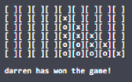

# Five In A Row

### Rules of the game:
   - Players take turns dropping x/o-shaped discs into a 6x9 grid.
   - A player wins if they form a line of 5 of their own discs.
   
 e.g.
   
   
   
   
   
    
   
   - If the grid fills up without a winner the game ends as a draw 
   
   e.g.
   
   
   
   - Maximum of 2 players can join a game.
   - Player 1 uses x-shaped discs.
   - Player 2 uses o-shaped discs.
   - x goes first.
   - State of the game is returned to the player after they make a move.
   - Players must input their own name and column number before each move.
   - Players can request the state of the game at any stage.
   - If a player leaves, the game ends and the other player wins.
   - If both players leave then the game restarts and new players may join.
 
 ### Simplifications:
   - A client was not built. Instead, the Swagger UI is used to emulate a client.
   - If player 1 makes a move then player 2 is not prompted for input. Player 2 must request the state in order to see the move made by player 1.
  
### Assumptions:
   - The application doesn't handle timeouts, therefore, it's assumed that the players will leave after the game ends.
   - It's assumed players will regularly request the state when waiting for an opponent to move.

# Application setup

### Requirements
   - Java 8 with Maven.

### How to Run (command line)
- ```cd``` into the project's directory
- ```mvn clean package```
- ```java -jar target/FiveInARow-0.0.1-SNAPSHOT.jar server src/main/resources/conf.yaml```
- Open your browser and go to http://localhost:8888/swagger#/v1/

### Open Swagger Client

1. Go to http://localhost:8888/swagger#/v1/
2. Go to http://localhost:8888/swagger#/v1/join
   - Click "Try it out"
   - Add player 1 name and click execute 
   - Add player 2 name and click execute
3. Go to http://localhost:8888/swagger#/v1/move
   - Click "Try it out"
   - Input name and column 
   - Click "Execute"
4. Go to http://localhost:8888/swagger#/v1/state 
   - Click "Try it out"
   - Input name
   - Click "Execute"
  
### Swagger UI Tutorial

- Choose the request you want to make
   

- Click "Try it out"

   
   
- Enter parameters and click "Execute"

   
   
- Read the response from the server in the "Response Body"

   